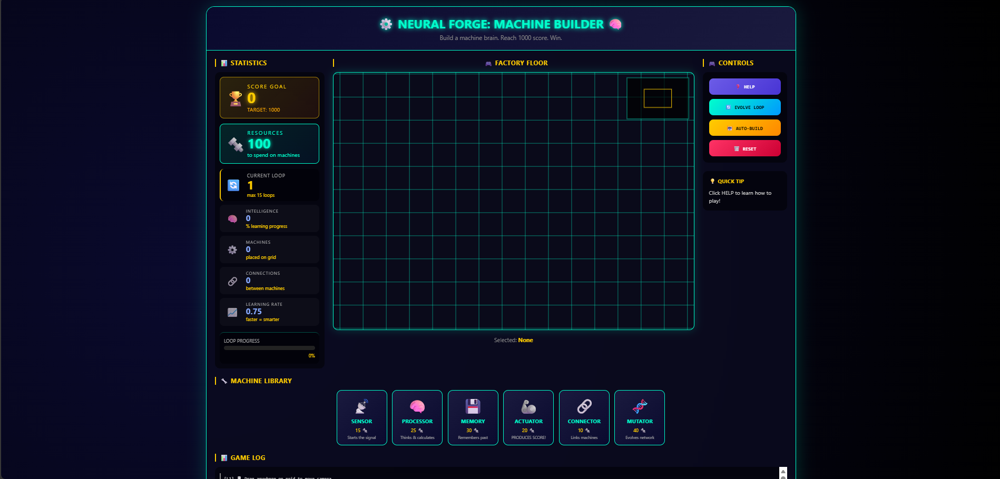
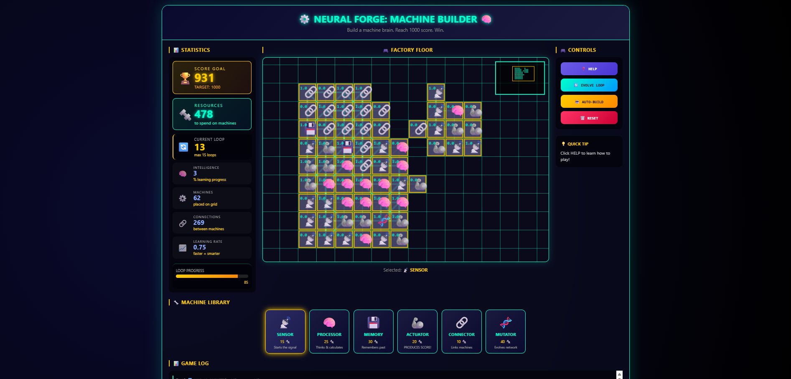

# 🧠 NEURAL FORGE: MACHINE BUILDER

[](https://itch.io/jam/gamedevjs-2026)
[](LICENSE)
[](https://wavedash.com/games/neural-forge)
[](https://github.com/raghul-tech/neural-forge)

**Build a living machine brain that learns over time. Reach 1000 points within 15 loops to win!**

---

## 🎮 ABOUT THE GAME

**Neural Forge** is a strategic builder game where you create a network of machines that **learn and evolve**. Each machine acts like a brain cell. Connected together, they "think" and produce SCORE points.

### 🎯 OBJECTIVE
- Reach **1000 SCORE** within **15 loops** to achieve machine consciousness
- Strategically place and connect machines to optimize your neural network
- Balance resource management with network complexity

### 🎮 GAMEPLAY LOOP
1. Select a machine from library
2. Click on grid to place it
3. Machines automatically connect nearby
4. Press EVOLVE LOOP to end round
5. Your machines produce resources and SCORE
6. Repeat until you reach 1000 SCORE!

---

## SCREENSHOTS

### Game Layout


### Game Play Area


---

## MACHINE TYPES

| Machine | Icon | Cost | Role | Best Placement |
|---------|------|------|------|----------------|
| **SENSOR** | 📡 | 15 🔩 | Starts signal (like eyes) | Beginning of network |
| **PROCESSOR** | 🧠 | 25 🔩 | Thinks and calculates | Middle of network |
| **MEMORY** | 💾 | 30 🔩 | Remembers past loops | After 5+ machines |
| **ACTUATOR** | 🦾 | 20 🔩 | **PRODUCES SCORE!** | End of network |
| **CONNECTOR** | 🔗 | 10 🔩 | Links far apart machines | When network grows |
| **MUTATOR** | 🧬 | 40 🔩 | Evolves connections | Late game |

---

## 🏆 WINNING STRATEGY

| Loops | Strategy | Goal |
|-------|----------|------|
| **1-3** | 2 SENSORS + 2 PROCESSORS + 1 ACTUATOR | Build foundation |
| **4-7** | Add 2 ACTUATORS + 1 MEMORY | Double production |
| **8-12** | Add CONNECTORS + MUTATOR | Boost learning |
| **13-15** | Maximize ACTUATORS | Reach 1000 SCORE! |

---

## 🕹️ CONTROLS

| Action | How |
|--------|-----|
| **Select machine** | Click on machine card |
| **Place machine** | Left click on grid |
| **Remove machine** | Right click on grid |
| **Move camera** | Click + drag on grid |
| **End loop** | Click EVOLVE LOOP |
| **Auto-build** | Click AUTO-BUILD |
| **Reset game** | Click RESET |

---

## 🚀 QUICK START

### Play Online
1. Visit [live demo](https://raghul-tech.github.io/Neural-Forge)
2. Click **HELP** to read instructions
3. Start building your neural network!

### Local Development
```bash
# Clone the repository
git clone https://github.com/raghul-tech/Neural-Forge.git
cd Neural-Forge

# Simply open index.html in your browser
# Double-click index.html or right-click → Open with browser
```

**Note**: This is a pure HTML/CSS/JavaScript game - no server required! Just open `index.html` directly.

---

## 📁 PROJECT STRUCTURE

```
Neural-Forge/
├── index.html          # Main game page
├── style.css           # Game styling & animations
|── js
|  ├── game.js             # Core game logic
|  ├── neural-net.js       # Neural network AI
|  ├── sounds.js           # Sound effects
|── img
|  ├── img1.png      # Game Layout
|  ├── img2.png   # Game Play area
├── README.md           # This file
|── CHANGELOG.md        # Version history
|── CONTRIBUTING.md     # Contribution guidelines
|── wavedash.toml        # WaveDash configuration
└── LICENSE             # MIT License
```

---

## 🛠️ TECHNICAL FEATURES

### Core Technologies
- **Pure JavaScript** - No external frameworks
- **HTML5 Canvas** - Smooth grid-based rendering
- **CSS3** - Modern UI with neon animations
- **Web Audio API** - Dynamic sound effects

### Game Systems
- **Neural Network** - Machines that learn and adapt
- **Camera Panning** - Drag to move around large grid
- **Resource Management** - Strategic spending
- **Auto-save** - Progress persists across sessions
- **Win/Loss States** - Persistent game results

### Visual Design
- **Cyberpunk aesthetic** with neon cyan/gold colors
- **Smooth animations** and visual feedback
- **Responsive layout** for all screen sizes
- **Mini-map** shows your position in the world

---

## GAME FEATURES

| Feature | Description |
|---------|-------------|
| **35x25 World** | Large grid you can pan around |
| **6 Machine Types** | Each with unique role |
| **15 Loops** | Limited rounds to reach goal |
| **Learning System** | Machines adapt over time |
| **Auto-build AI** | Computer helps with placement |
| **Sound Effects** | Audio feedback for actions |
| **Confetti** | Celebration on victory! |
| **Persistent Saves** | Game state survives refresh |

---

## 🌐 CHALLENGES ENTERED

This game is submitted to the following Gamedev.js Jam 2026 challenges:

| Challenge | Status |
|-----------|--------|
| 🟢 Open Source by GitHub | ✅ Code on GitHub with MIT license |
| 🟢 YouTube Playables | ✅ Works in 2 minutes, mobile friendly |
| 🟢 Deploy to Wavedash | ✅ Leaderboard & analytics integrated |

---

## 📊 STATISTICS TRACKED

| Stat | What It Means |
|------|--------------|
| **SCORE** | Your progress toward 1000 goal 🏆 |
| **RESOURCES** | Currency to buy machines 🔩 |
| **LOOP** | Current round (max 15) |
| **INTELLIGENCE** | How smart your network has become |
| **MACHINES** | Number of machines placed |
| **CONNECTIONS** | Links between machines |
| **LEARNING RATE** | How fast machines adapt |

---

## 💡 TIPS FOR BEGINNERS

- **Start simple** - Just build SENSOR → PROCESSOR → ACTUATOR first
- **Actuators win games** - They're the only machines that produce SCORE
- **Keep machines close** - They auto-connect within 2 spaces
- **Use AUTO-BUILD** - The AI helps when you're stuck
- **Read the HELP menu** - Full strategy guide inside the game

---

## 🌐 BROWSER SUPPORT

| Browser | Support |
|---------|---------|
| Chrome 60+ | ✅ Full |
| Firefox 55+ | ✅ Full |
| Safari 12+ | ✅ Full |
| Edge 79+ | ✅ Full |
| Mobile browsers | ✅ Touch support |

---

## 📝 VERSION HISTORY

| Version | Date | Changes |
|---------|------|---------|
| 1.0.0 | April 2026 | Initial release for Gamedev.js Jam 2026 |

---

## 🙏 ACKNOWLEDGMENTS

- **Gamedev.js Jam 2026** - For the amazing event and theme "Machines"
- **Wavedash** - For leaderboard and analytics platform
- **Open Source Community** - For inspiration and tools
- **All playtesters** - For valuable feedback

---

## 📄 LICENSE

This project is licensed under the MIT License - see the LICENSE file for details.

You are free to:
- ✅ Use this code commercially
- ✅ Modify and distribute
- ✅ Use privately
- ❌ Hold liable (use at your own risk)

---

## 🔗 LINKS

| Platform | Link |
|----------|------|
| **Play Online** | [GitHub Pages](https://raghul-tech.github.io/neural-forge) |
| **Itch.io Entry** | [raghul-tech.itch.io](https://raghul-tech.itch.io) |
| **GitHub Repo** | [github.com/raghul-tech/neural-forge](https://github.com/raghul-tech/neural-forge) |
| **Wavedash** | [wavedash.com/games/neural-forge](https://wavedash.com/games/neural-forge) |

---

## 👨‍💻 DEVELOPER

Created with ❤️ for Gamedev.js Jam 2026

**Theme**: "Machines"  
**Year**: 2026  
**Duration**: 13 days

---

## 📞 CONTACT

- **GitHub**: [@raghul-tech](https://github.com/raghul-tech)
- **Itch.io**: [raghul-tech.itch.io](https://raghul-tech.itch.io)
- **Email**: [raghul.tech.app@gmail.com](mailto:raghul.tech.app@gmail.com)

---

## ⭐ RATING & REVIEWS

If you enjoy Neural Forge, please:

- ⭐ Star the GitHub repository
- 🎮 Rate on Itch.io
- 📢 Share with friends

---

Build your machine brain. Reach 1000 score. Win the jam. 🏆

*Made for Gamedev.js Jam 2026 - Theme: "MACHINES"*
